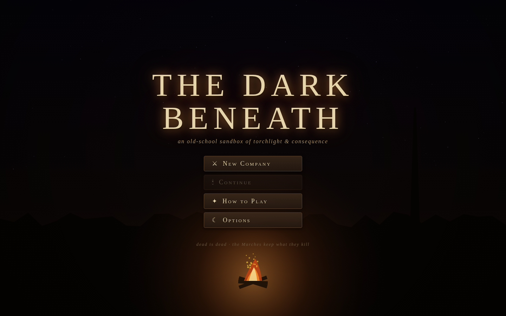
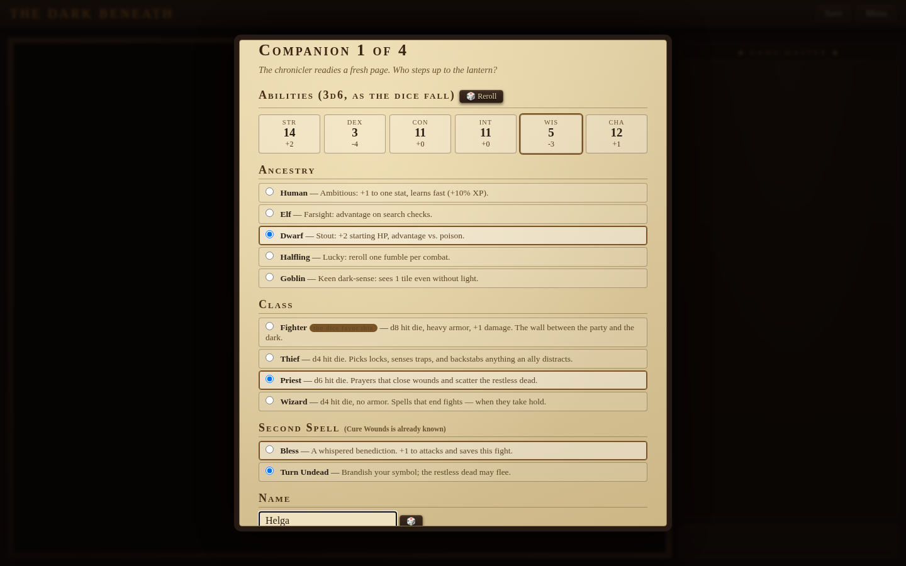
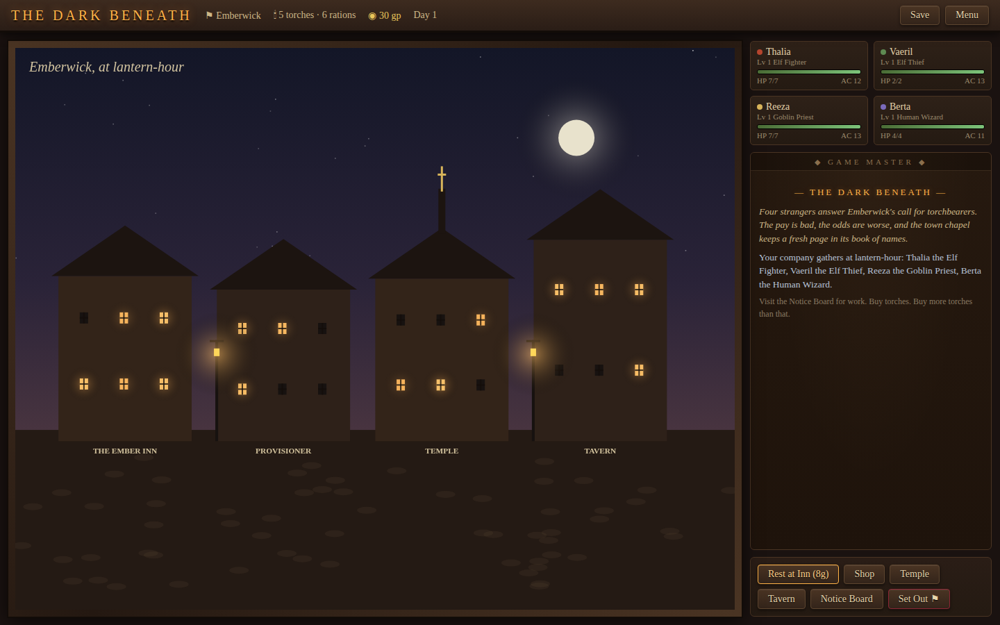
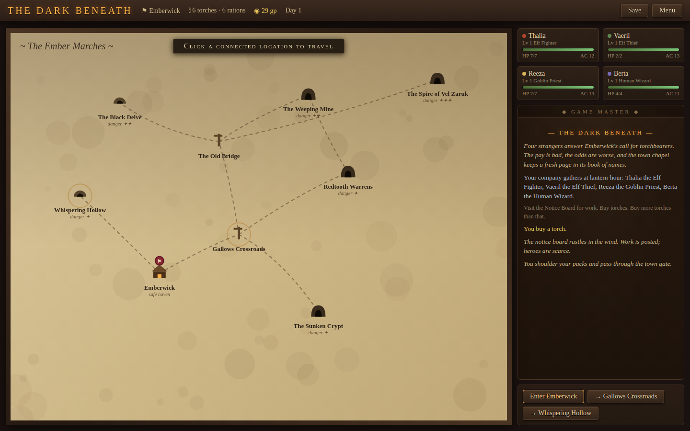
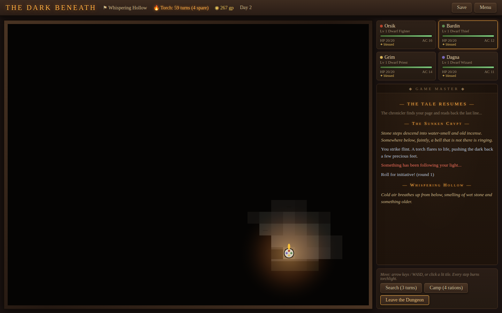
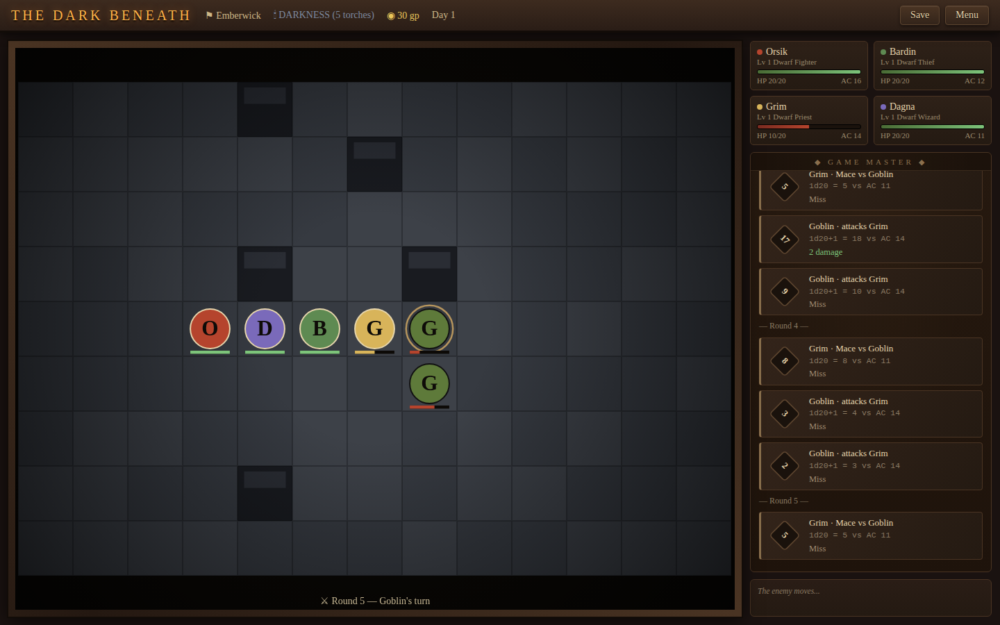

# The Dark Beneath

A browser RPG in the spirit of old-school tabletop games (heavily inspired by
*Shadowdark*): a virtual-tabletop presentation — open dice rolls, a Game Master
narration log, parchment character sheets — wrapped around a non-linear sandbox
where light is a resource and death is permanent.

| | |
|---|---|
|  |  |
|  |  |
|  |  |

## Running it

```bash
npm install
npm run dev        # dev server
npm run build      # type-check + production build
npm run preview    # serve the production build
```

No assets, no game framework — TypeScript + Canvas 2D, everything drawn
procedurally.

## The game

Roll your own **company of four** — 3d6 down the line (reroll as your
conscience allows), pick ancestry, class, name, and starting spell for each
companion, or Quick Start and let fate fill the roster. You run them out of the town
of **Emberwick**, taking bounties from the notice board into the Ember Marches:
a hand-built overworld of authored dungeons — the Sunken Crypt, the Redtooth
Warrens, the Weeping Mine, the Spire of Vel Zaruk — plus procedurally generated
caves that are never the same twice, in any order you dare. Danger scales by
region, not to your level. North is worse.

### The rules (Shadowdark-inspired, not verbatim)

- **d20 rolls in the open** — every check, attack, and casting roll appears as
  a dice card in the GM log, with advantage/disadvantage where earned.
- **Torches burn down.** Every dungeon step and action ticks your torch. When
  it dies, you see almost nothing, and the dark gets bold (wandering monsters
  come three times as often). Buy more torches than you think you need.
- **Gear slots**: you carry what your STR allows. Treasure takes room.
- **Lethal combat**: turn-based on a battle grid — initiative, move + action.
  At 0 HP you're dying with a few rounds on the clock; allies can stabilize,
  priests can pull you back. If nobody does, **dead is dead** — the temple
  records the name, and you hire a replacement at the tavern.
- **Casting is a gamble**: spells roll to take hold; a failure spends the spell
  until rest, a natural 1 burns the caster.
- **Morale**: most monsters flee when a fight turns against them. Skeletons
  don't.

### Systems

- Hand-authored dungeons (ASCII maps) with secret doors, traps, locked doors,
  braziers, altars, flooded halls, and boss lairs — cleared rooms stay cleared.
- Procgen cellular-automata caves that regenerate every visit.
- Overworld travel with tiered random-encounter tables.
- Town: inn (full rest), provisioner (buy/sell), temple (healing/blessing and
  the Book of Names), tavern (recruits + rumors), notice board (bounties).
- XP from monsters, chests, and bounties; class abilities and new spells as you
  level.
- Fog of war with real line-of-sight torchlight, flickering glow, and a
  parchment-and-lantern-light VTT interface.
- Animated title screen (campfire, embers, the Spire on the horizon) and an
  in-game menu on Esc: save, options, help, return to title.
- **Procedural sound**, no audio files: every effect is synthesized live with
  WebAudio — dice rattles, steel, coin, spell shimmer, door creaks, the
  mourning bell — plus ambient wind, fire crackle, and cave drips per scene.
  Volume/mute in Options.
- Save anytime (localStorage); autosaves at the inn and on new games.

## Code layout

```
src/
  types.ts      shared interfaces (no imports)
  rng.ts        seeded RNG + dice notation
  data.ts       items, spells, monsters, world graph, ASCII dungeon maps, tables
  rules.ts      checks, character math, chargen, advancement
  state.ts      global game state, save/load, UI-decoupling hooks
  log.ts        GM narration log + dice roll cards
  sound.ts      procedural WebAudio synth: SFX + ambience
  modal.ts      shared modal / title-screen DOM chrome
  chargen.ts    character creation flow (stats, ancestry, class, name, spell)
  dungeon.ts    map building (authored + procgen), fog/light, exploration
  combat.ts     battle grid, initiative, spells, morale, dying/death
  overworld.ts  travel + random encounters
  town.ts       inn/shop/temple/tavern/notice board
  render.ts     all Canvas 2D drawing (lighting, tokens, scenes)
  ui.ts         DOM chrome: party cards, action bar, modals
  main.ts       game loop, input, click-to-walk pathing
scripts/
  smoke.mjs     headless-browser smoke test (needs a running preview server)
```

## Smoke test

```bash
npm run build && npm run preview &   # serve on :4173
node scripts/smoke.mjs               # boots the game, starts a run, fails on JS errors
```
